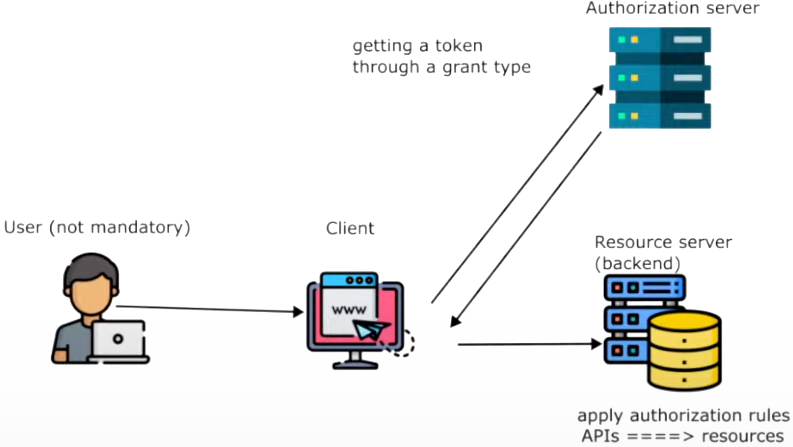
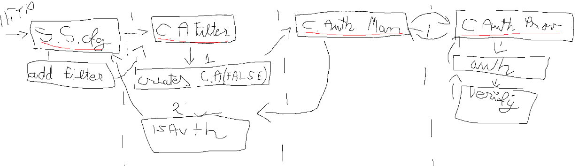

### Method Authorization example

---

1. How does the client get a token (grant types)?
2. How does the resource server (backend) validate and get data with the token?

- [ ] 1.1. Authorization Code Grant (PKCE)
- [ ] 1.2. Client Credentials Grant
- [ ] 1.3. Refresh Token Grant 

